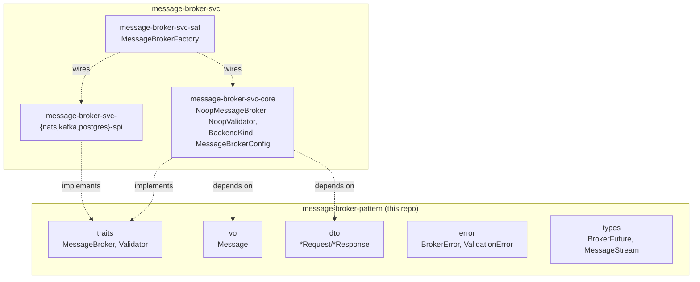

# message-broker-pattern Architecture

## Overview

One crate, `message-broker-pattern` — the `MessageBroker`/`Validator` traits and the
minimal vocabulary their signatures require, zero implementation, zero knowledge of any
backend technology:

- **`traits/`** — `MessageBroker` (`publish`/`subscribe`/`health_check`/`validator`),
  `Validator` (`validate`).
- **`vo/`** — `Message` (payload + headers), the currency the trait passes around.
- **`dto/`** — `PublishRequest`/`SubscribeRequest`/`SubscribeResponse`/
  `HealthCheckRequest`/`ValidatorRequest`/`ValidatorResponse`/`ValidationRequest`.
- **`error/`** — `BrokerError`, `ValidationError`.
- **`types/`** — `BrokerFuture` (the async return type every `MessageBroker` method
  uses — needs only `std::future::Future`), `MessageStream` (needs `futures::Stream`
  directly, since Rust's `std` doesn't stabilize a stream trait yet).

Everything that would make this crate aware of a specific technology — a no-op
reference implementation, real NATS/Kafka/Postgres backends, the config vocabulary for
selecting among them, and the facade that dispatches to one — lives in
[`message-broker-svc`](https://github.com/sweengineeringlabs/message-broker-svc)
instead. This repo has no knowledge of, and no dependency on, any of it.

## Component Diagram

## Why the dependency footprint is exactly `futures` + `thiserror`

A pure trait/type crate isn't obligated to have zero dependencies — only zero
dependencies its type *signatures* don't structurally require. Two things earn their
place:

- **`futures`** — `MessageStream`'s definition (`Pin<Box<dyn Stream<...>>>`) names
  `futures::Stream` directly. The type alias can't exist without it. `BrokerFuture`
  itself needs nothing beyond `std::future::Future`.
- **`thiserror`** — derive-macro convenience for `BrokerError`/`ValidationError`'s
  `Display`/`Error` impls. Boilerplate, not domain logic — the same category
  `wasm-capability-pattern-contract` itself accepts (a hand-written `PartialEq`, in
  that case).

Everything else this crate depended on before — `bytes` (a convenience constructor
parameter, retyped to `impl Into<Vec<u8>>`) and `serde` (only needed by `BackendKind`,
which no longer lives here) — dropped entirely. See ADR-001's amendment for the full
reasoning, including why `BackendKind` was removed rather than genericized.

## Why `BrokerFuture` and `Message`'s constructors live here, in this crate

`BrokerFuture<'a, T>` and `Message` both need an inherent `impl` — `BrokerFuture::new`/
its `Future` impl, and `Message::new`/`Message::with_headers`. Rust requires an inherent
impl to live in the same crate as the type it's implementing on. This mirrors
`wasm-capability-pattern-contract`'s own precedent (a hand-written `PartialEq` on its one
`entity` type, in that same crate) — a contract/port crate can hold small, structural
`impl`s; "zero implementation" means it implements none of *its own* primary traits
(`MessageBroker`/`Validator`), not that the `impl` keyword never appears.

## History

Ported from `edge-message-broker`'s single-crate `main/src/{api,core,saf}` module tree
per [edge-message-broker#6](https://github.com/sweengineeringlabs/edge-message-broker/issues/6),
initially as a three-crate `contract`/`core`/`saf` split mirroring `wasm-capability-pattern`.
Flattened to this single crate, with `core`/`saf`/`BackendKind`/`MessageBrokerConfig` all
moved into `message-broker-svc`, per ADR-001's amendment — see that document for the full
reasoning.

`spi/broker_backend.rs`'s `BrokerBackend` marker type was never ported at all: it was
`pub(crate)` in the original single crate, referenced nowhere outside its own file, and
its own test file didn't actually exercise it either — dead code kept alive only by a
`dead_code`-lint workaround.

[← Docs index](../README.md)
