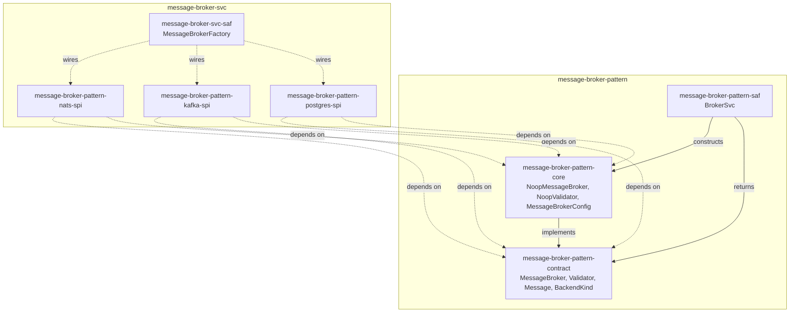

# message-broker-pattern Architecture

## Overview

Three crates — contract, core, and saf:

- **`message-broker-pattern-contract`** (`scm/main/message-broker/contract`) — the
  trait/type surface: `MessageBroker`, `Validator`, `Message`, `BackendKind`, the
  `*Request`/`*Response` DTOs, `BrokerError`/`ValidationError`, `BrokerFuture`/
  `MessageStream`. Zero implementation of any named backend.
- **`message-broker-pattern-core`** (`scm/main/message-broker/core`) — the one default
  implementation this pattern ships itself: `NoopMessageBroker`/`NoopValidator` (no
  external technology dependency), plus `MessageBrokerConfig` — the `[message_broker]`
  config vocabulary and its cross-field validation (`Validator`/`OptionalSection`
  impls). `MessageBrokerConfig` lives here, not in `contract`, precisely because those
  impls are real logic and a real `configbuilder` dependency, not a zero-implementation
  contract shape.
- **`message-broker-pattern-saf`** (`scm/main/message-broker/saf`) — the facade:
  `BrokerSvc`, the sole construction seam. A consumer depends on `contract` + `saf`
  alone and never imports `core` directly — enforced, not a convention left to
  discipline.

Everything else — a technology-specific `MessageBroker` implementation (NATS, Kafka,
Postgres) — belongs in
[`message-broker-svc`](https://github.com/sweengineeringlabs/message-broker-svc) instead.
This repo has no knowledge of, and no dependency on, any of its consumers.

## Component Diagram

## Why `BrokerFuture` and `Message`'s constructors live in `contract`

`BrokerFuture<'a, T>` (the async return type every `MessageBroker` method uses) and
`Message` (the pub/sub payload type) both need an inherent `impl` — `BrokerFuture::new`/
its `Future` impl, and `Message::new`/`Message::with_headers`. Rust requires an inherent
impl to live in the same crate as the type it's implementing on, so both stay in
`contract` alongside their struct declarations, rather than split into `core` the way
`edge-message-broker`'s single-crate `api`/`core` module split allowed. This mirrors
`wasm-capability-pattern-contract`'s own precedent (a hand-written `PartialEq` on its one
`entity` type, in that same crate) — a contract/port crate can hold small, structural
`impl`s; "zero implementation" means it implements none of *its own* primary traits
(`MessageBroker`/`Validator`), not that the `impl` keyword never appears.

## Extraction from `edge-message-broker`

Ported from `edge-message-broker`'s single-crate `main/src/{api,core,saf}` module tree
per [edge-message-broker#6](https://github.com/sweengineeringlabs/edge-message-broker/issues/6).
One thing was deliberately **not** ported: `spi/broker_backend.rs`'s `BrokerBackend`
marker type. It was `pub(crate)`, referenced nowhere outside its own file, and its own
test file (`broker_backend_int_test.rs`) didn't actually exercise it either — dead code
kept alive only by a `dead_code`-lint workaround. This repo's target shape
(`contract`/`core`/`saf`, no `spi` layer) has no slot for it either.

[← Docs index](../README.md)
