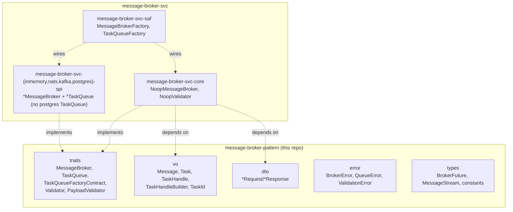

# message-broker-pattern Architecture

## Overview

One crate, `message-broker-pattern` — every primitive of this domain, zero
implementation, zero knowledge of any backend technology:

- **`traits/`** — `MessageBroker` (`publish`/`subscribe`/`health_check`/`validator`),
  `TaskQueue` (`enqueue`/`dequeue`/`health_check`), `TaskQueueFactoryContract`
  (`new_task_id`/`build_handle`), `Validator` (`validate(request)` — backend config
  validation), `PayloadValidator` (`validate(&self)` — generic self-validation, distinct
  from `Validator`).
- **`vo/`** — `Message` (payload + headers, the currency `MessageBroker` passes around),
  `Task`/`TaskHandle`/`TaskHandleBuilder`/`TaskId` (the equivalent currency for
  `TaskQueue`).
- **`dto/`** — `PublishRequest`/`SubscribeRequest`/`SubscribeResponse`/
  `HealthCheckRequest`/`ValidatorRequest`/`ValidatorResponse`/`ValidationRequest`.
- **`error/`** — `BrokerError`, `QueueError`, `ValidationError`.
- **`types/`** — `BrokerFuture` (the async return type every `MessageBroker` method
  uses — needs only `std::future::Future`), `MessageStream` (needs `futures::Stream`
  directly, since Rust's `std` doesn't stabilize a stream trait yet), and marker
  constants (`VALIDATOR_SVC`, `TASK_QUEUE_FACTORY_CONTRACT_ID`,
  `MAX_TASK_PAYLOAD_BYTES`, `TASK_ID_HEADER_KEY`).

Everything that would make this crate aware of a specific technology — a no-op
reference implementation, real NATS/Kafka/Postgres backends, and the facade that
dispatches to one — lives in
[`message-broker-svc`](https://github.com/sweengineeringlabs/message-broker-svc)
instead. This repo has no knowledge of, and no dependency on, any of it. Nor does it
know about any specific *application's* composition choices: no config-section name,
no default-backend value, no `ApplicationConfig`-shaped type — a contract crate
declares what a backend *is*, never how a specific application chooses or configures
one.

## Component Diagram

## Why the dependency footprint is `bytes` + `futures` + `thiserror` + `uuid`

A pure trait/type crate isn't obligated to have zero dependencies — only zero
dependencies its type *signatures* don't structurally require. Four things earn their
place:

- **`bytes`** — `Task`/`TaskHandle`/`TaskHandleBuilder`'s `payload` field is `Bytes`
  directly (not retyped to `impl Into<Vec<u8>>`), matching how `TaskQueue`
  implementations actually carry payloads.
- **`futures`** — `MessageStream`'s definition (`Pin<Box<dyn Stream<...>>>`) names
  `futures::Stream` directly, and `TaskHandle`/`TaskHandleBuilder`'s `ack`/`nack`
  fields are `BoxFuture<'static, Result<(), QueueError>>`. `BrokerFuture` itself needs
  nothing beyond `std::future::Future`.
- **`thiserror`** — derive-macro convenience for `BrokerError`/`QueueError`/
  `ValidationError`'s `Display`/`Error` impls. Boilerplate, not domain logic — the same
  category `wasm-capability-pattern-contract` itself accepts (a hand-written
  `PartialEq`, in that case).
- **`uuid`** — `TaskId` wraps `Uuid` directly and generates one via `Uuid::new_v4()`.

`serde` (only needed by `BackendKind`, which never lives here) stays out entirely. See
ADR-001's amendment for why `BackendKind`/`MessageBrokerConfig` were removed rather
than genericized.

## Why `BrokerFuture`/`Message`/`Task`-family constructors live here, in this crate

`BrokerFuture<'a, T>`, `Message`, `TaskId`, `Task`, `TaskHandle`, and
`TaskHandleBuilder` each need an inherent `impl` — constructors, `Display`, and
`BrokerFuture`'s own `Future` impl. Rust requires an inherent impl to live in the same
crate as the type it's implementing on. This mirrors `wasm-capability-pattern-contract`'s
own precedent (a hand-written `PartialEq` on its one `entity` type, in that same crate)
— a contract/port crate can hold small, structural `impl`s; "zero implementation" means
it implements none of *its own* primary traits (`MessageBroker`/`TaskQueue`/
`Validator`/`PayloadValidator`), not that the `impl` keyword never appears.

## History

Ported from `edge-message-broker`'s single-crate `main/src/{api,core,saf}` module tree
per [edge-message-broker#6](https://github.com/sweengineeringlabs/edge-message-broker/issues/6),
initially as a three-crate `contract`/`core`/`saf` split mirroring `wasm-capability-pattern`.
Flattened to this single crate, with `core`/`saf`/`BackendKind`/`MessageBrokerConfig` all
moved into `message-broker-svc`, per ADR-001's amendment — see that document for the full
reasoning.

`spi/broker_backend.rs`'s `BrokerBackend` marker type was never ported at all: it was
`pub(crate)` in the original single crate, referenced nowhere outside its own file, and
its own test file didn't actually exercise it either — dead code kept alive only by a
`dead_code`-lint workaround.

## `TaskQueue`'s belated migration

`TaskQueue`, `TaskQueueFactoryContract`, `Task`/`TaskHandle`/`TaskHandleBuilder`/
`TaskId`, `QueueError`, the payload-validation trait (`PayloadValidator`, renamed on
arrival — see below), and the marker constants now live here, but didn't from the
start. `edge-runtime`'s own port of this crate's original content
(`runtime-message-broker-contract`, later renamed `-pattern`) is a superset that also
defines `TaskQueue` — a distinct competing-consumer work-queue contract with no
`MessageBroker` equivalent — but that half was left behind in `edge-runtime` instead of
migrating here alongside `MessageBroker`. That was an incomplete migration, not a
deliberate scope boundary: a consumer is supposed to get this domain's whole primitive
set from this crate plus `message-broker-svc`, not half of it redefined downstream in
every consuming repo. Ported into this crate directly from `edge-runtime`'s copy,
unchanged apart from one necessary rename: `edge-runtime`'s own `Validator` trait
(`fn validate(&self) -> Result<(), String>`, a generic self-check) collided by name
with this crate's own `Validator` (`fn validate(&self, request: ValidationRequest) ->
Result<(), ValidationError>`, backend config validation) — genuinely different
contracts that happened to share a name across two crates that had never been merged
before. Renamed to `PayloadValidator` on arrival to resolve the collision; its
signature and semantics are otherwise untouched.

`message-broker-svc` now implements `TaskQueue` too:
`message-broker-svc-{inmemory,nats,kafka}-spi` each ship a `*TaskQueue` alongside
their `*MessageBroker` (no `postgres` — that backend never had one), and
`message-broker-svc-saf`'s `TaskQueueFactory` constructs them, mirroring
`MessageBrokerFactory`'s own shape — see that repo's own architecture doc. With
that landed, `edge-runtime`'s local `core`/`spi/{kafka,nats}` crates held nothing
but duplicated re-exports of primitives and backends that now live upstream, so
they were deleted outright rather than kept as pass-throughs.
`runtime-message-broker-saf` is the only crate `edge-runtime` has left in this
domain, depending on this crate and `message-broker-svc-*-spi` directly — a
consumer gets this domain's whole primitive set and every real backend from two
published repos, none of it redefined downstream.

[← Docs index](../README.md)
